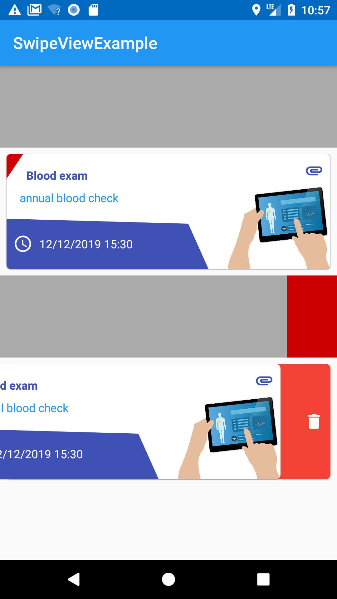

# SwipeView
A swipe view for Android

SwipeView behaves like every other Android view, it supports state saving (open or closed) if an id is associated with that view.

You can specify the `layout` you want to use as a `front_layout` and the one you want to use as `back_layout`.

## Images



## Usage

SwipeView behaves like every other Android view, it supports state saving (open or closed) if an id is associated with that view.

You can specify the `layout` you want to use as a `front_layout` and the one you want to use as `back_layout`.

### Layout

#### Swipe view with default layout
```xml
<it.marcosignoretto.swipeview.SwipeView
    android:layout_width="match_parent"
    android:layout_height="wrap_content"/>
```

#### Swipe view with custom front and back layout
You can specify the `layout` resource file that you want to use as a `front_layout` and the one you want to use as `back_layout` using the appropriate xml attributes.

```xml
<it.marcosignoretto.swipeview.SwipeView
    android:id="@+id/swipeView"
    android:layout_width="match_parent"
    android:layout_height="wrap_content"
    app:back_layout="@layout/delete_back_view"
    app:front_layout="@layout/report_item_front"/>
```

### Code
You can manipulate and register listeners for the view events.

To open the view programmatically use the function `open()`
To close the view use `close()` instead.

#### Front view click listener
You can register a listener for the click on the front view using the normal `setOnClickListener`.

The click on this view is detected only when the view is in the `closed` state.
```kotlin
view1.setOnClickListener(View.OnClickListener {
    Toast.makeText(this, "Front view clicked", Toast.LENGTH_SHORT).show()
})
```

#### Back view click listener
If you want to handle a click on the back view you have to register a listener using `setOnBackViewClickListener`.

The click on this view is detected only when the view is in the `open` state.
```kotlin
view1.setOnBackViewClickListener(View.OnClickListener {
    Toast.makeText(this, "Back view clicked", Toast.LENGTH_SHORT).show()
})
```

#### Swipe view listener
You can also register a `SwipeViewListener` to be notified when the view has been opened or closed.

```kotlin
view1.setOnSwipeViewListener(object : SwipeViewListener {
    override fun onOpen() {
        Toast.makeText(this@MainActivity, "View opened", Toast.LENGTH_SHORT).show()
    }

    override fun onClose() {
        Toast.makeText(this@MainActivity, "View closed", Toast.LENGTH_SHORT).show()
    }
})
```

## Future improvements

1. possibility to customize the opening size of the views
2. Maven


